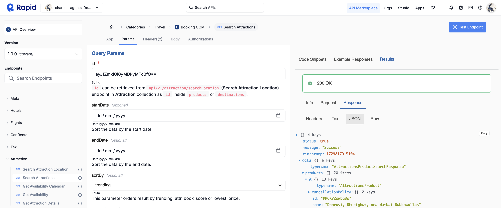
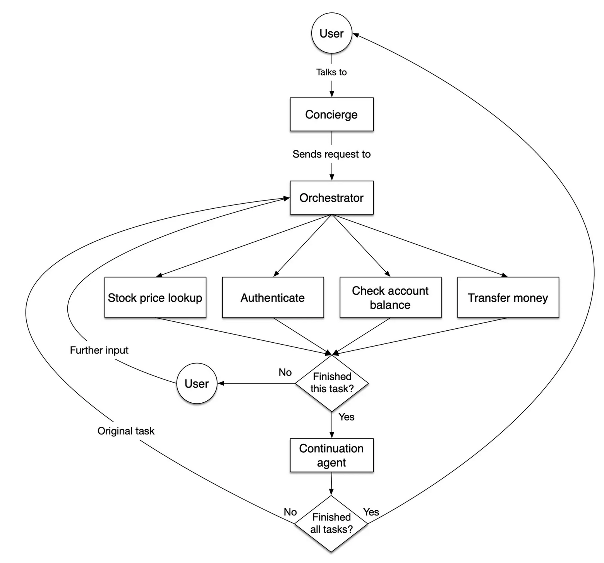

# Multi-agent travel concierge system

This repo contains an implementation of a multi-agent travel concierge system evaluating different agent frameworks to perform the following tasks.

See plan ref: https://docs.google.com/document/d/1Djkg-hVUWiGyd-faL7Afj_Lju21aklLe2cXkHPdsdwM/edit?usp=sharing


## TODO

### Backend

1. [ ] Flight API tool
2. [ ] Hotel API tool
3. [ ] Sightseeing Rec API tool

We've signed up for an org subscription on RapidAPI to access Booking.com API for hotels, flights, car rental, taxi and attraction information. Please reach [@charleneleong-ai]( @charleneleong-ai) for access in Whatsapp if need.



### Frontend

1. [ ] Streamlit/Chainlit Frontend to allow user to query and render response
2. [ ] Ability to toggle between the different frameworks

### Types of Agents/Tasks to Complete


| #  | Task                                                                                                     | Autogen | CrewAI  | LlamaIndex | LangChain |
|----|----------------------------------------------------------------------------------------------------------|---------|---------|------------|-----------|
| 1  | Suggest sights to visit                                                                                  | [ ]     | [ ]     | [ ]        | [ ]       |
| 2  | Suggest suitable ways of transportation (flights, trains, etc.)                                          | [ ]     | [ ]     | [ ]        | [ ]       |
| 3  | Suggest where to sleep (hotels, AirBnbs, open air, etc.)                                                  | [ ]     | [ ]     | [ ]        | [ ]       |
| 4  | Review legal limitations (visa requirements, local laws, etc.)                                            | [ ]     | [ ]     | [ ]        | [ ]       |
| 5  | Generate a descriptive image related to the travel plan or destination                                    | [ ]     | [ ]     | [ ]        | [ ]       |
| 6  | Generate a summary of the conversation, summarizing the travel plan                                       | [ ]     | [ ]     | [ ]        | [ ]       |
| 7  | Interpret the items to be taken on the trip through a photo and recommend any missing items for the user   | [ ]     | [ ]     | [ ]        | [ ]       |

## Comparing Constructs

A high-level comparison comparing multi-agent frameworks.

| Autogen | CrewAI  | LlamaIndex | LangChain  |
--------------|---------------|---------------|------------|
| Actions     | Tasks         | Steps         | Edges      |
| Coordinators     | Agents        | Events        | Nodes      |
| Multi-agent System        | Crews         | Workflows     | Graphs     |

**TODO:**: Add these later.

|  Agora Swarms | OpenAI Swarm |
|-------------|--------------|
|  Tasks      | Routines     |
|  Agents     | Handoffs     |
|  Swarm      | Swarm        |


## Why build this?

Interactive chat bots are by this point a familiar solution to customer service, and agents are a frequent component of chat bot implementations. They provide memory, introspection, tool use and other features necessary for a competent bot.

We have become interested in larger-scale chatbots: ones that can complete dozens of tasks, some of which have dependencies on each other, using hundreds of tools. What would that agent look like? It would have an enormous system prompt and a huge number of tools to choose from, which can be confusing for an agent.

A **global state** is used, that keeps track of the user and their current state, shared between all the agents. This state is available in any tool call, using the `FunctionToolWithContext` class.

There is also an **orchestration agent**: this agent will interact with the user when no active speaker is set. It will look at the current user state and list of available agents, and decide which agent to route the user to next.

The flow of the the system looks something like this:



## Getting Started

Setup initial virtual env
```zsh
make init
```

Install all deps
```zsh
make install
```

If you want to install only the deps of specific framework
```zsh
make install-llama-index
```

Please free to add/modify to the `Makefile` as needed.

**NOTE**: All deps have been grouped in `pyproject.toml`. If packages in `pyproject.toml` are updated, run `make sync` to sync the venv deps.


## Running tests

To run tests locally

```zsh
make test
```

When testing changes to tests.yml in Github CI, you can download local Act runner [here](https://github.com/nektos/act) to tests CI changes locally before pushing.
